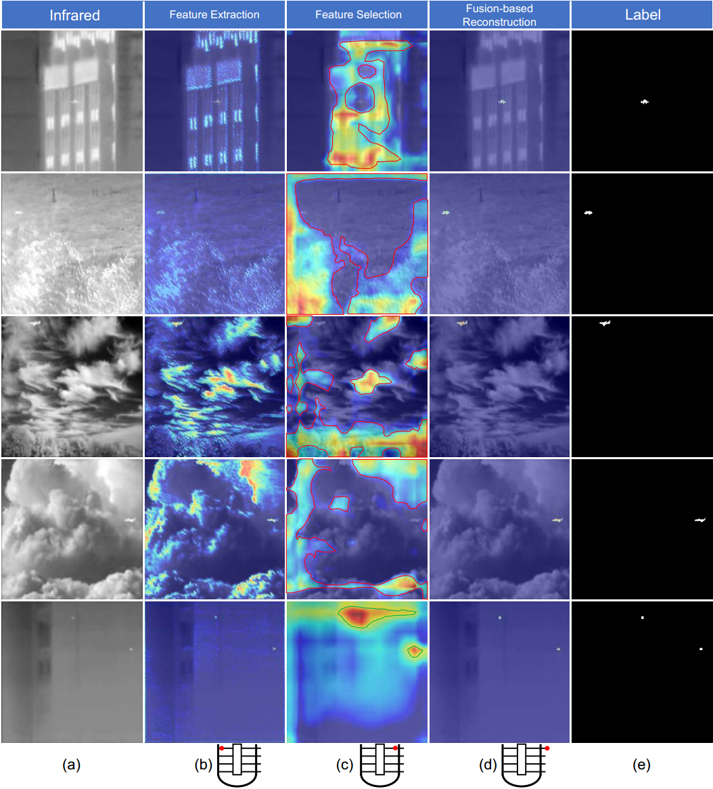
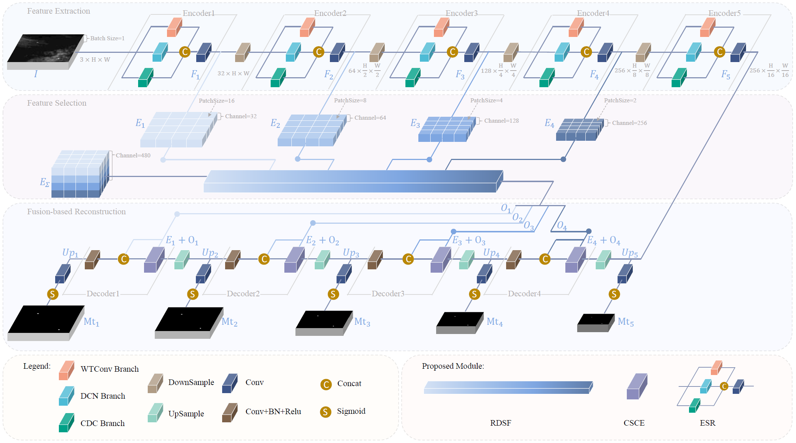
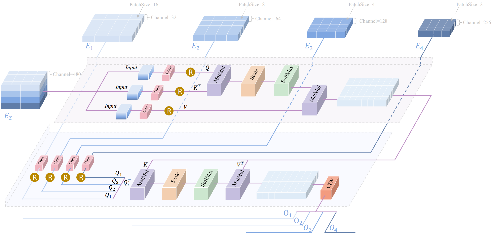
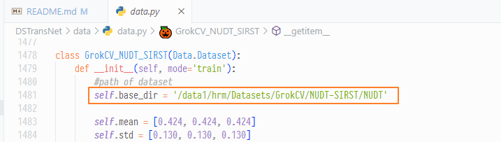
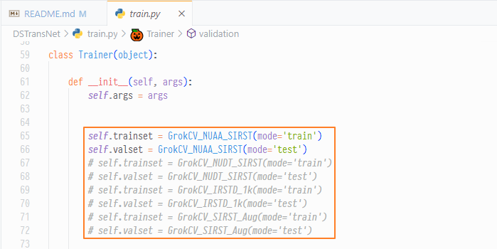
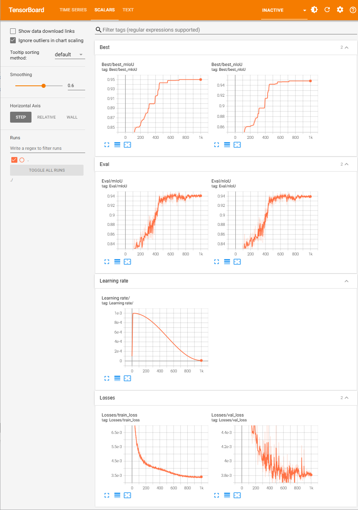
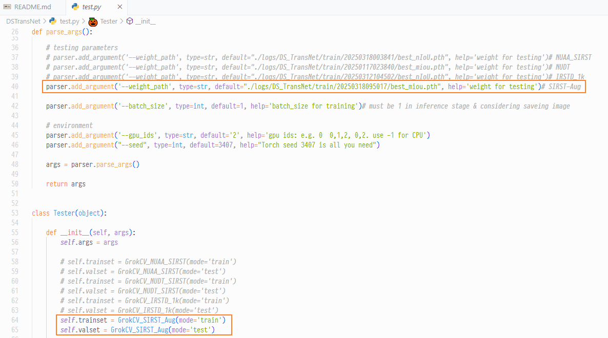
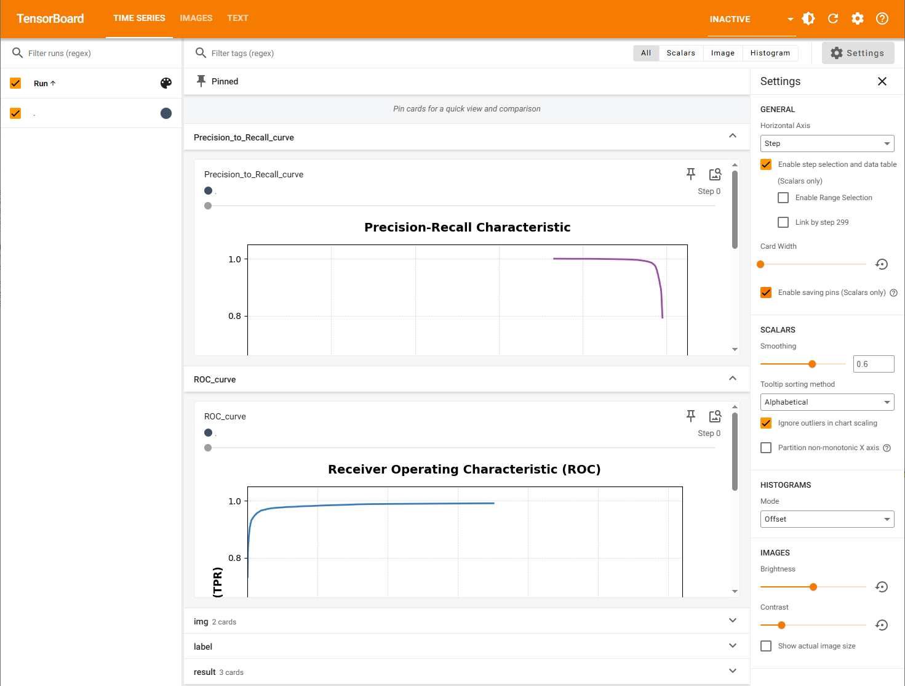
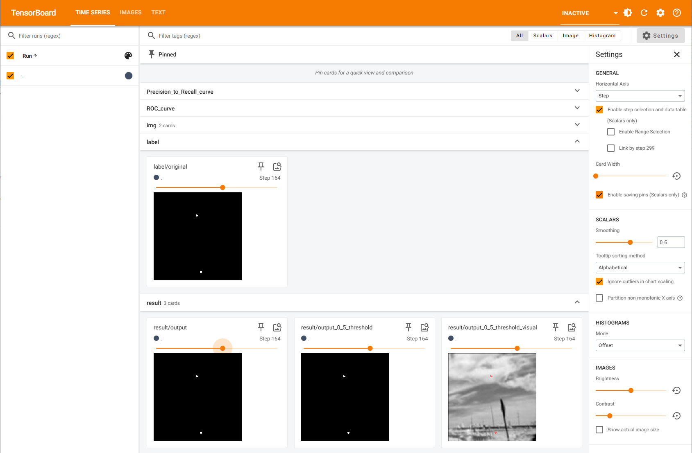
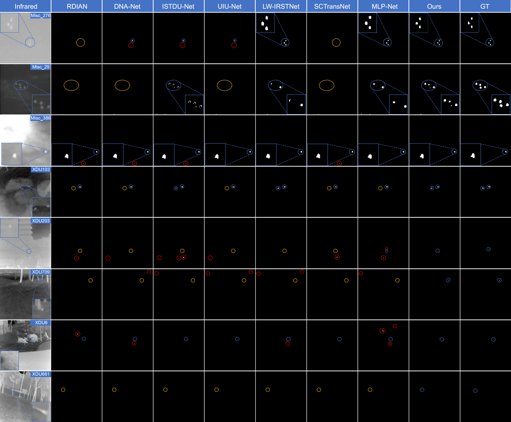

# DSTransNet

[](https://github.com/RuiminHuang/DSTransNet)
[](https://www.python.org/)
[](https://pytorch.org/)
[](./LICENSE)
[](https://github.com/RuiminHuang/DSTransNet)

The official implementation of the paper "DSTransNet: Dynamic Feature Selection Network with Feature Enhancement and Multi-Attention for Infrared Small Target Detection" in PyTorch.

> This repository provides **clean and readable** code with **comprehensive test metrics** (Pd, Fa, ROC, and PR curves).

## Contents

- [:sparkles: 1. Introduction](#sparkles-1-introduction)
- [:building_construction: 2. The Network](#building_construction-2-the-network)
  - [:repeat: 2.1 Overall Pipeline](#repeat-21-overall-pipeline)
  - [:jigsaw: 2.2 Core Module](#jigsaw-22-core-module)
- [:rocket: 3. Installation](#rocket-3-installation)
- [:bar_chart: 4. Dataset Preparation](#bar_chart-4-dataset-preparation)
  - [:link: 4.1 Datasets Link](#link-41-datasets-link)
  - [:file_folder: 4.2 File Structure](#file_folder-42-file-structure)
- [:fire: 5. Train](#fire-5-train)
- [:dart: 6. Test](#dart-6-test)
- [:trophy: 7. Benchmark and Model Zoo](#trophy-7-benchmark-and-model-zoo)
  - [:chart_with_upwards_trend: 7.1 Quantitative Results](#chart_with_upwards_trend-71-quantitative-results)
  - [:framed_picture: 7.2 Qualitative Results](#framed_picture-72-qualitative-results)
  - [:package: 7.3 Model Zoo](#package-73-model-zoo)
- [:bookmark_tabs: 8. Citation](#bookmark_tabs-8-citation)
- [:star2: 9. Star History](#star2-9-star-history)
- [:email: 10. Contact](#email-10-contact)


---

## :sparkles: 1. Introduction

<div align="center">
  
</div>

The heatmaps illustrate the areas of interest for various layers within the model. Layers subjected to specific analysis are indicated by red dots beneath the figure. (a) infrared image. (b) feature extraction stage, heatmap of focused features. (c) feature selection stage. Areas marked by red borders represent the suppression of false-alarm features, and areas marked by green borders signify the enhancement of small target features. (d) feature fusion-based reconstruction stage. Attention is paid to small target features during the reconstruction process. (e) ground truth label.

## :building_construction: 2. The Network

### :repeat: 2.1 Overall Pipeline

Overall architecture of the proposed DSTransNet. It incorporates three stages. The feature extraction stage is responsible for finer feature extraction. The feature selection stage aims to suppress false alarms similar to small targets and enhance real small target features. The fusion-based reconstruction stage emphasises small target features and reconstructs the final multi-scale small target mask.

### :jigsaw: 2.2 Core Module

Proposed RDSF module. It serves to suppress false alarms similar to small targets and enhance real small target features.


## :rocket: 3. Installation

* Step 1. Clone the repository

```shell
git clone git@github.com:RuiminHuang/DSTransNet.git
cd DSTransNet
```

* Step 2. Create environment and install dependencies

```shell
conda create --name DSTransNet python=3.12
conda activate DSTransNet
conda install pytorch==2.4.1 torchvision==0.19.1 torchaudio==2.4.1 pytorch-cuda=12.1 -c pytorch -c nvidia
pip install tensorboard==2.19.0
pip install tqdm==4.65.0
```


## :bar_chart: 4. Dataset Preparation


### :link: 4.1 Datasets Link
The dataset comes from [this GitHub repository](https://github.com/GrokCV/SeRankDet). The datasets used in this project and the dataset split files can be downloaded from the following links:

* SIRST Dataset
  * [Baidu Netdisk](https://pan.baidu.com/s/1LgnBKcE8Cqlay5GnXfUaLA?pwd=grok)
  * [OneDrive](https://1drv.ms/f/s!AmElF7K4aY9pgYEgG0VEoH3nDbiWDA?e=gkUW2W)
* NUDT-SIRST Dataset
  * [Baidu Netdisk](https://pan.baidu.com/s/16BbL9H38cIcvaBh4tPNTCw?pwd=grok)
  * [OneDrive](https://1drv.ms/f/s!AmElF7K4aY9pgYEdBMrQDFM1Vi24DQ?e=vBNoN4)
* IRSTD1K Dataset
  * [Baidu Netdisk](https://pan.baidu.com/s/1nRoZu1eI9BLnpmsxw0Kdwg?pwd=grok)
  * [OneDrive](https://1drv.ms/f/s!AmElF7K4aY9pgYEepi2ipymni0amNQ?e=XZILFh)
* SIRST-AUG Dataset
  * [Baidu Netdisk](https://pan.baidu.com/s/1_kAocokYSclQNf_ZLWPIhQ?pwd=grok)
  * [OneDrive](https://1drv.ms/f/s!AmElF7K4aY9pgYEfdtbrZhLsbd0ITg?e=thyA6h)


### :file_folder: 4.2 File Structure

```shell
|- datasets
    |- NUAA
        |-trainval
            |-images
                |-Misc_1.png
                ......
            |-masks
                |-Misc_1.png
                ......
        |-test
            |-images
                |-Misc_50.png
                ......
            |-masks
                |-Misc_50.png
                ......
    |-NUDT
    |-IRSTD1k
    |-SIRSTAUG
```


Before running the code, make sure to update the dataset path in the config file:



## :fire: 5. Train

```shell
python train.py
```

Before training, specify the target datasets in the configuration file:



To view train process, run TensorBoard with:

```shell
tensorboard --port=8010 --samples_per_plugin=images=100000 --logdir=./
```




## :dart: 6. Test

```shell
python test.py
```

Before testing, specify the pre-trained weights and target datasets in the configuration file:




To view test results, run TensorBoard with:

```shell
tensorboard --port=8010 --samples_per_plugin=images=100000 --logdir=./
```





## :trophy: 7. Benchmark and Model Zoo

### :chart_with_upwards_trend: 7.1 Quantitative Results


| Datasets      | mIoU (x10(-2)) | nIoU (x10(-2)) | Pd (x10(-2))|  Fa (x10(-6))|
|:-------------:|:-------------:|:-----:|:-----:|:-----:|
| SIRST         | 75.61  |  75.55 | 98.17 | 17.57 |
| NUDT-SIRST    | 95.03  |  94.84 | 99.53 | 0.46  | 
| IRSTD-1K      | 68.35  |  67.78 | 93.94 | 19.93 |
| SIRST-Aug     | 74.67  |  71.18 | 99.86 | 19.54 |


### :framed_picture: 7.2 Qualitative Results

2D visualization of detection results across different methods on representative images from SIRST and IRSTD1K datasets. Blue, yellow, and red circles denote correct detections, missed detections, and false alarms, respectively.

### :package: 7.3 Model Zoo

TensorBoard logs, train logs, test logs, pre-trained weights, and test results are available on [Google Drive](https://drive.google.com/drive/folders/1Cktwh19m4gm0PVY63o_HWHXe6CXkqhOf?usp=sharing). Just download and unzip it to the [log path](./logs/).

## :bookmark_tabs: 8. Citation

If you find this repository useful for your research, please consider citing our paper using the following BibTeX entry.

```bibtex
@article{huang2025dstransnet,
  title={DSTransNet: Dynamic Feature Selection Network With Feature Enhancement and Multiattention for Infrared Small Target Detection},
  author={Huang, Ruimin and Huang, Jun and Ma, Yong and Fan, Fan and Zhu, Yiming},
  journal={IEEE Transactions on Geoscience and Remote Sensing},
  volume={63},
  pages={1--18},
  year={2025},
  publisher={IEEE}
}
```

## :star2: 9. Star History

If you find this repository useful for your research, please consider giving it a star.

[](https://star-history.com/#RuiminHuang/DSTransNet&Date)

## :email: 10. Contact

Please feel free to raise issues or email to [huang_ruimin@whu.edu.cn](huang_ruimin@whu.edu.cn) for any questions regarding our DSTransNet.


