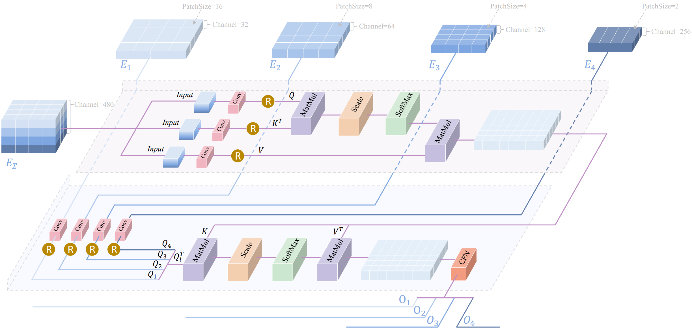

# DSTransNet

The official implementation of the paper "Dynamic Feature Selection: A Novel Network with Feature Enhancement and Dynamic Attention for Infrared Small Target Detection" in PyTorch.

## Contents
- [Introduction](#introduction)
- [The network](#the-network)
  - [Overall Pipeline](#overall-pipeline)
  - [Core Module](#core-module)
- [Installation](#installation)
- [Dataset Preparation](#dataset-preparation)
  - [File Structure](#file-structure)
  - [Datasets Link](#datasets-link)
- [Training](#training)
- [Test](#test)
- [Model Zoo and Benchmark](#model-zoo-and-benchmark)
  - [Leaderboard](#leaderboard)
  - [Visualization](#visualization)
  - [Model Zoo](#model-zoo)
- [Citation](#citation)

## Introduction

The heatmaps illustrate the areas of interest for various layers within the model. Layers subjected to specific analysis are indicated by red dots beneath the figure. (a) infrared image. (b) feature extraction stage, heatmap of focused features. (c) feature selection stage. Areas marked by red borders represent the suppression of false-alarm features, and areas marked by green borders signify the enhancement of small target features. (d) feature fusion-based reconstruction stage. Attention is paid to small target features during the reconstruction process. (e) ground truth label.

## The network

### Overall Pipeline

Overall architecture of the proposed DSTransNet. It incorporates three stages. The feature extraction stage is responsible for finer feature extraction. The feature selection stage aims to suppress false alarms similar to small targets and enhance real small target features. The fusion-based reconstruction stage emphasises small target features and reconstructs the final multi-scale small target mask.

### Core Module

Proposed RDSF module. It serves to suppress false alarms similar to small targets and enhance real small target features.

## Installation

## Dataset Preparation

### File Structure

### Datasets Link

## Training

## Test

## Model Zoo and Benchmark

### Leaderboard

### Visualization

2D visualization of detection results across different methods on representative images from SIRST and IRSTD1K datasets. Blue, yellow, and red circles denote correct detections, missed detections, and false alarms, respectively.

### Model Zoo

## Citation
